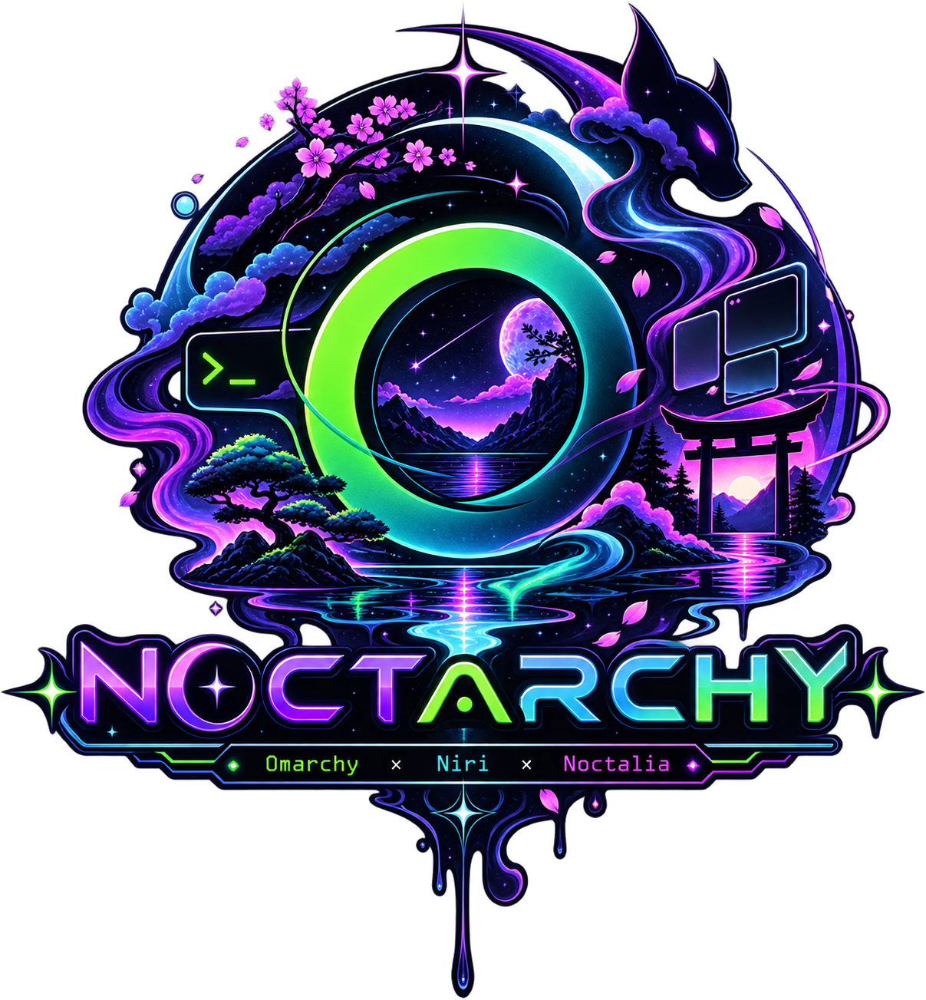
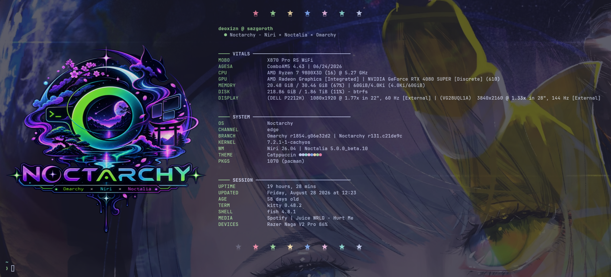
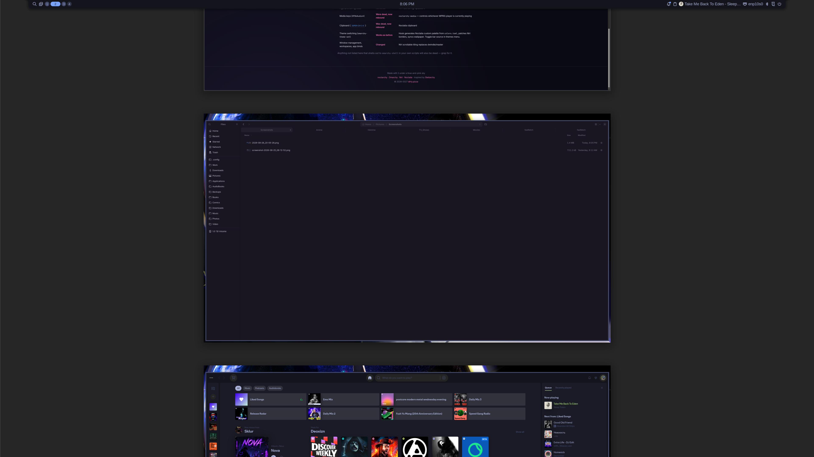

<div align="center">



[noctarchy.dirty.pizza](https://noctarchy.dirty.pizza)

</div>

<p align="center">
  <a href="CHANGELOG.md">CHANGELOG</a>&nbsp;&nbsp;|&nbsp;&nbsp;
  <a href="#read-this-first">Read First</a>&nbsp;&nbsp;|&nbsp;&nbsp;
  <a href="#install">Install</a>&nbsp;&nbsp;|&nbsp;&nbsp;
  <a href="#upgrading-an-existing-install">Upgrading</a>&nbsp;&nbsp;|&nbsp;&nbsp;
  <a href="#noctarchy-branding">Branding</a>&nbsp;&nbsp;|&nbsp;&nbsp;
  <a href="#keybindings">Keybinds</a>&nbsp;&nbsp;|&nbsp;&nbsp;
  <a href="#menu-suite">Menu Suite</a>&nbsp;&nbsp;|&nbsp;&nbsp;
  <a href="HiddenCommands.md">Hidden Menu</a>&nbsp;&nbsp;|&nbsp;&nbsp;
  <a href="#uninstall">Uninstall</a>
</p>

<p align="center">
  
</p>
<p align="center">
  
</p>
<p align="center">
  
</p>

<br><br>

<a id="read-this-first"></a>

```
▄▖     ▌ ▄▖▌ ▘   ▄▖▘    ▗
▙▘█▌▀▌▛▌ ▐ ▛▌▌▛▘ ▙▖▌▛▘▛▘▜▘
▌▌▙▖█▌▙▌ ▐ ▌▌▌▄▌ ▌ ▌▌ ▄▌▐▖
```

**This is not a theme or a plugin — it is a shell replacement.** It removes
`omarchy-shell` and Hyprland from your system and replaces them with
**Niri** (scrollable-tiling Wayland compositor) and **Noctalia** (C++23
desktop shell). That means some things you may use daily in stock Omarchy
**stop existing** until something replaces them: keybindings routed into
`omarchy-shell` become silent no-ops, its menus and lock screen disappear,
and the idle path changes. This repo rebinds or replaces every dead path it
can, but expect Omarchy to *not* behave stock out of the box — if you want
stock behavior with a different bar, this remux is not that.

### What happens to stock Omarchy parts

Highlights only; the full compatibility matrix lives at
[noctarchy.dirty.pizza](https://noctarchy.dirty.pizza):

| Stock Omarchy | In Noctarchy | Replacement / notes |
|---|---|---|
| omarchy-shell (bar, notifications, OSD) | **Removed** | Noctalia provides all three |
| omarchy-shell menus + lock screen | **Removed** | Fuzzel suite `noctarchy-*`; Noctalia lock screen |
| Media keys / clipboard / emoji panels | **Rebound** | `noctarchy-media`, Noctalia clipboard |
| Theme switching (`omarchy-theme-set`) | **Works as before** | A hook bridges each theme's colors.toml into Noctalia's theming pipeline |
| Window management, workspaces, app binds | **Changed** | Niri scrollable tiling replaces Hyprland dwindle/master |
| Hyprland Lua config (`*.lua`) | **Removed** | Niri KDL config (`config.kdl`) |

Anything not listed here that shells out to `omarchy-shell` or Hyprland
elsewhere in your own scripts will also be dead — grep for it.

### What doesn't work like stock Omarchy

Honest list of the remaining gaps:

- **Compositor is different**: Niri's scrollable-tiling paradigm is
  fundamentally different from Hyprland's dwindle/master. Windows tile in
  horizontal columns that scroll, never resize each other. You must relearn
  window management habits.
- **No plugin system**: Niri has no Hyprland-style C++ plugin API.
  Functionality comes from the compositor + shell + companion tools.
- **Config format changed**: KDL (Niri) and TOML (Noctalia) replace
  Lua (Hyprland) and JSON (Caelestia).
- **Noctalia is a different shell**: bar layout, launcher, notifications,
  lock screen, and wallpaper management all behave like Noctalia, not
  Caelestia/omarchy-shell. Noctalia supports per-compositor integration
  but the UX is its own.
- **Noctalia is native C++23**: no Quickshell/Qt dependency. Lighter
  memory footprint (~50 MB vs ~300 MB/monitor for Quickshell shells)
  but a different extension model.
- **`omarchy-shell` IPC callers die**: any personal script calling
  `omarchy-shell <...>` needs porting to `niri msg action ...`,
  Noctalia IPC, or the noctarchy suite.

<br><br>

<a id="install"></a>

```
▄▖    ▗   ▜ ▜   ▗ ▘
▐ ▛▌▛▘▜▘▀▌▐ ▐ ▀▌▜▘▌▛▌▛▌
▟▖▌▌▄▌▐▖█▌▐▖▐▖█▌▐▖▌▙▌▌▌
```

```bash
git clone https://github.com/deoxizn/noctarchy.git ~/.local/opt/noctarchy
cd ~/.local/opt/noctarchy
./install.sh
```

Use `./install.sh -y` to skip confirmation prompts, or `--dry-run` to preview everything without touching anything.

### What it does

- Install Niri and Noctalia (all deps handled)
- Back up existing configs, then install Niri KDL config and Noctalia TOML config
- Disable Omarchy's shell autostart (survives pacman updates and config reloads) and launch Noctalia instead via systemd service
- Set up the theme bridge hook and managed idle/lock stack
- Own the idle/sleep stack: Noctalia's built-in idle handling replaces stock Omarchy's `omarchy-sleep-lock.service`
- Apply Niri config patches idempotently ([`patches/`](patches/)) and install the omarchy-update guard (a libalpm hook re-applies it after every omarchy upgrade)
- Install an auto-sync hook into omarchy-update's post-update path: every system update pulls this repo and re-runs `sync.sh` when new commits exist (logged to `~/.local/state/noctarchy/repo-sync.log`, desktop-notified on failure) — older installs catch up once with `git pull && ./sync.sh`, then it stays current on its own
- Install the fuzzel menu suite + `noctarchy-media` (see [Menu suite](#menu-suite)) — including System → Kernel (CachyOS opt-in + boot-entry repair) and System → Splash (adopt/refresh the boot splash) — seed the fastfetch OS line, deploy branding art
- Sync your current theme
- Run the session-start preflight, then auto-logout after 5s if every check passed (Ctrl+C cancels) — logout uses `omarchy-system-logout` (`uwsm stop`) so the session ends cleanly

After logging back in: test `SUPER+D` (launcher), `SUPER+Ctrl+L` (lock) and `omarchy-theme-set <theme>`.

### Session-start preflight (safety net)

Before offering to log you out, the installer verifies the chain your next
login depends on: autostart stub placement, valid Niri config, Noctalia
config, and `noctalia.service` health (enabled, real binary,
systemd-analyze clean).

**All checks pass** → normal logout prompt. **Any check fails** → automatic
rollback to fully usable stock Omarchy (configs restored from backup, service
disabled) instead of a dead session. Everything, including what was rolled
back, lands in `~/noctarchy-preflight.log` — send it for help or hand it to
your AI agent, then fix and re-run.

Noctalia didn't start after an older install? Press `Ctrl+Alt+F4` for a TTY,
log in, then:

```bash
cat ~/noctarchy-preflight.log                     # see what's wrong
systemctl --user start noctalia.service           # bring the shell back now
```

<br><br>

### CachyOS kernel (opt-in, post-install)

Kernel and splash live in the menus: **System → Kernel** (CachyOS opt-in, boot-entry status & repair) and **System → Splash** (adopt/refresh the boot splash) under `SUPER+Alt+Space` — plain scripts (`noctarchy-kernel`, `noctarchy-splash`) if you prefer a terminal.

Kernel variants (Kernel menu), all prebuilt from chaotic-aur:

| Variant | Package | One-liner |
|---|---|---|
| `default` | `linux-cachyos` | EEVDF scheduler + CachyOS optimizations — the balanced choice |
| `bore` | `linux-cachyos-bore` | BORE scheduler — lowest latency under load; the gaming pick |
| `eevdf` | `linux-cachyos-eevdf` | Explicit EEVDF build (no CachyOS scheduler extras) |
| `lts` | `linux-cachyos-lts` | Long-term support kernel — fewest surprises |
| `rt-bore` | `linux-cachyos-rt-bore` | Real-time patches + BORE |

CachyOS kernels tune CPU scheduling — BORE for lowest latency under load (the
gaming pick), EEVDF default, plus LTS and real-time variants. Prebuilt from
[chaotic-aur](https://aur.chaotic.cx), so nothing compiles.

Pick a variant in the Kernel menu (or `noctarchy-kernel run <variant>`):
`default | bore | eevdf | lts | rt-bore`.

Adds `[chaotic-aur]` to `pacman.conf` (backed up first) and installs the
chosen kernel + headers (DKMS modules like NVIDIA rebuild automatically).
Limine's path-based `default_entry:` header follows the kernel by name, so it
survives snapshot churn. The stock Arch kernel is never removed — revert any
time via the Limine menu + one `default_entry:` edit. Full opt-out: remove the
`[chaotic-aur]` block from `/etc/pacman.conf`.

<br><br>

<a id="upgrading-an-existing-install"></a>

```
▖▖         ▌▘
▌▌▛▌▛▌▛▘▀▌▛▌▌▛▌▛▌
▙▌▙▌▙▌▌ █▌▙▌▌▌▌▙▌
  ▌ ▄▌         ▄▌
```

```bash
./sync.sh          # apply current checkout to the install (the auto-sync hook runs this after pulling)
```

Your configs stay yours — KDL/TOML updates merge in, conflicts never touch your files, and every replaced file is backed up in `~/.config/noctarchy-backup/`. Preview with `--dry-run`; `--adopt-kdl` adopts repo KDL versions that have no merge history (yours is backed up first).

<br><br>

<a id="noctarchy-branding"></a>

```
▄        ▌▘
▙▘▛▘▀▌▛▌▛▌▌▛▌▛▌
▙▘▌ █▌▌▌▙▌▌▌▌▙▌
             ▄▌
```

The remux ships its own identity on top of Omarchy. What lands where:

| Touchpoint | New installs | Existing installs (`sync.sh` / menus) |
|---|---|---|
| Idle screensaver art | Installed | Installed if missing or still stock Omarchy art; **your own customization is never overwritten** |
| About logo (`about.txt`) | Installed | Same stock-detection rule |
| fastfetch OS line | If you have no own config, one is seeded from `/etc/fastfetch` with a commit-stamped `Noctarchy r<count>.<sha>` OS line; custom configs are untouched | Same |
| Script headers | Included | Synced with the menu suite |

<br><br>

<a id="keybindings"></a>

```
▖▖    ▌ ▘   ▌
▙▘█▌▌▌▛▌▌▛▌▛▌▛▘
▌▌▙▖▙▌▙▌▌▌▌▙▌▄▌
    ▄▌
```

| Binding | Action |
|---|---|
| `SUPER+Space` | Fuzzel launcher (quick) |
| `SUPER+D` | Noctalia launcher (full) |
| `SUPER+Alt+Space` | Noctarchy root menu |
| `SUPER+Enter` | Terminal |
| `SUPER+Shift+B` | Browser |
| `SUPER+Shift+E` | Editor (nvim) |
| `SUPER+Shift+F` | File manager |
| `SUPER+K` | Keybinding list (fuzzel) |
| `SUPER+Q` | Close window |
| `SUPER+Escape` | Power menu |
| `SUPER+O` | Overview |
| `SUPER+F` | Maximize column |
| `SUPER+Ctrl+F` | Fullscreen window |
| `SUPER+R` | Cycle column width |
| `SUPER+Shift+R` | Tabbed display |
| `SUPER+Shift+Space` | Toggle floating |
| `SUPER+P` / `SUPER+Shift+P` | Focus floating / Focus tiling |
| `SUPER+[ / ]` | Consume / expel from column |
| `SUPER+H/J/K/L` or arrows | Focus left/down/up/right |
| `SUPER+Ctrl+H/J/K/L` or arrows | Move window |
| `SUPER+1-9` | Focus workspace |
| `SUPER+Shift+1-9` | Move to workspace |
| `SUPER+U/I` | Workspace down/up |
| `SUPER+N` | Noctalia notifications |
| `SUPER+Comma` | Clear notifications |
| `SUPER+Ctrl+L` | Lock via Noctalia |
| `SUPER+Ctrl+V` | Clipboard history (Noctalia) |
| `SUPER+C/V/X` | Copy/paste/cut via wtype |
| `Media keys` | Play/pause, next, previous — any MPRIS player |
| `SUPER+Print` | Screenshot region to clipboard |
| `Ctrl+Print` | Screenshot region to file |
| `Alt+Print` | Screenshot fullscreen to clipboard |

All Niri keybindings are defined in `~/.config/niri/config.kdl`. Run
`niri msg --json event-stream` to debug bindings live.

<br><br>

<a id="menu-suite"></a>

```
▖  ▖       ▄▖  ▘▗
▛▖▞▌█▌▛▌▌▌ ▚ ▌▌▌▜▘█▌
▌▝ ▌▙▖▌▌▙▌ ▄▌▙▌▌▐▖▙▖
```

The omarchy-shell menus are recreated as standalone fuzzel scripts in
[`scripts/`](scripts/) (installed to `~/.local/bin/`). All of them are themed
from the live Noctalia scheme, so they restyle automatically on every theme
switch. Esc navigates back one menu level.

| Script | Purpose |
|---|---|
| `noctarchy-menu` | Root menu (alphabetized): Config, Packages, Restart, Setup, System, Themes, Trigger, Update |
| `noctarchy-trigger` / `noctarchy-hardware` / `noctarchy-speedtest` | Hardware toggles gated on detected hardware (laptop display, hybrid GPU, touchpad...) + network/disk speed tests |
| `noctarchy-setup` / `noctarchy-network` / `noctarchy-security` | DNS picker + Wi-Fi QR code, and security setup (fingerprint/FIDO2/sshd/sudo) |
| `noctarchy-system` | Config editor, default app pickers, and the Kernel / Splash submenus |
| `noctarchy-kernel` | Opt into a prebuilt CachyOS kernel (default/bore/eevdf/lts/rt-bore) via chaotic-aur; Limine `default_entry:` follows by name — plus boot-entry status & repair |
| `noctarchy-splash` | Adopt or refresh the Noctarchy boot splash (verifies the theme is self-contained before any initramfs rebuild) |
| `noctarchy-power` | Lock, logout, suspend, hibernate, reboot, shutdown (destructive actions require Confirm) |
| `noctarchy-keybinds` | Searchable keybinding list parsed from `config.kdl` — shows actual binds with descriptions |
| `noctarchy-themes` / `noctarchy-themes-list` | Theme switcher with preview thumbnails (fuzzel icon protocol) + git theme install |
| `noctarchy-pkgs` / `noctarchy-install` / `noctarchy-remove` | Packages → Install (package/AUR/web app) and Remove (package/web app/theme) submenus |
| `noctarchy-update` | Noctarchy system update, channel switcher, extra themes, firmware |
| `noctarchy-config` | Edit niri `config.kdl`, Noctalia `config.toml`, palettes, hooks, scripts |
| `noctarchy-defaults` | Default browser/editor/terminal/agent pickers (includes installed beta/nightly browsers) |
| `noctarchy-restart` | Reload Niri, restart Noctalia shell, refresh theme |
| `noctarchy-terminal` | Runs a command in a floating TUI.float terminal with logo/done polish |
| `noctarchy-media` | Universal MPRIS media control — targets whichever player is currently playing |
| `noctarchy-wifi-qr` | Renders the current Wi-Fi as a scannable QR in a floating terminal |
| `noctarchy-update-hardware` | Restart audio/Wi-Fi/Bluetooth/trackpad services |
| `noctarchy-fuzzel` | Shared fuzzel wrapper — reads colors from Noctalia's `config.toml` `[theming]` section |
| `noctarchy-version` | Prints the dots revision (`r<count>.<sha>`) shown on the fastfetch OS line |

### Niri-specific

- **Scrollable tiling**: windows tile in horizontal columns that scroll, never
  resize each other. `SUPER+[` consumes a window into the column, `SUPER+]`
  expels it.
- **Column presets**: `SUPER+R` cycles through column width presets (half,
  three-quarters, full).
- **Tabbed display**: `SUPER+Shift+R` toggles tabbed mode within a column.
- **Overview**: `SUPER+O` shows all workspaces and windows in an overview grid.

### Noctalia-specific

- **Launcher**: `SUPER+D` opens Noctalia's full Material You launcher.
- **Notifications**: `SUPER+N` toggles the notifications panel; `SUPER+Comma`
  clears the active notification.
- **Clipboard history**: `SUPER+Ctrl+V` opens the clipboard manager.
- **Lock screen**: `SUPER+Ctrl+L` locks via Noctalia's built-in lock screen
  (supports fingerprint via PAM).
- **Theme toggle**: the themes menu lets you switch between palette-derived bar
  colors (from `colors.toml`) and wallpaper-generated Material You colors.

<br><br>

<a id="uninstall"></a>

```
▖▖  ▘    ▗   ▜ ▜
▌▌▛▌▌▛▌▛▘▜▘▀▌▐ ▐
▙▌▌▌▌▌▌▄▌▐▖█▌▐▖▐▖
```

```bash
./uninstall.sh
```

Restores all backed-up configs, stops and removes the Noctalia systemd service, and removes Noctalia configs (including the update guard — which also self-neutralizes once Noctalia is no longer running). Log out/in to restore omarchy-shell.

## Requirements

- Omarchy installed
- base-devel (installer handles these and other deps)

## Credits

- [Omarchy](https://github.com/basecamp/omarchy) — window manager, theme system, keybindings
- [Niri](https://github.com/niri-wm/niri) — scrollable-tiling Wayland compositor
- [Noctalia](https://github.com/noctalia-dev/noctalia) — desktop shell, lock screen, launcher
- [Stellarchy](https://github.com/deoxizn/omartia-dots-remux) — architecture inspiration
